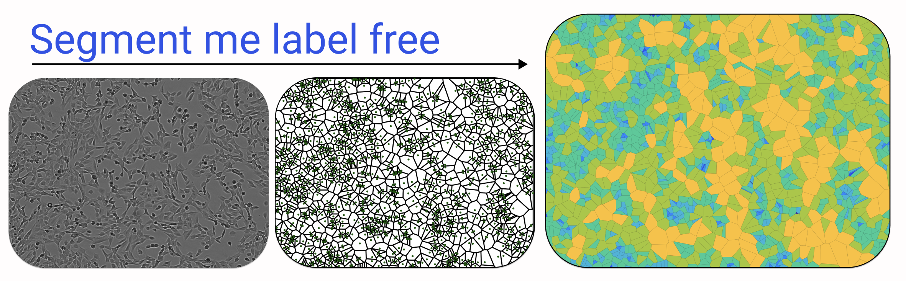
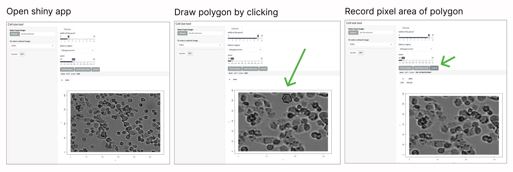
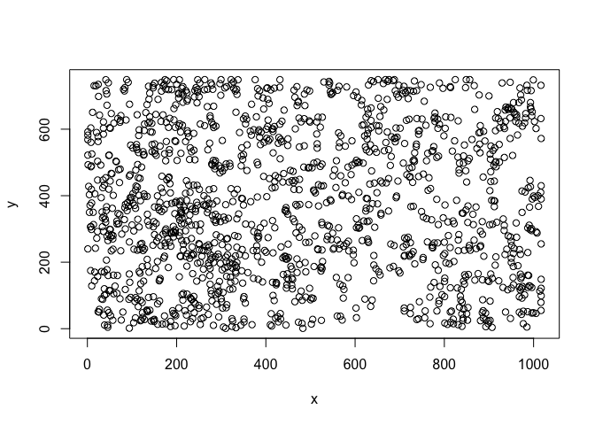

README
================

<!-- README.md is generated from README.Rmd. Please edit that file -->
<!-- badges: start -->
<!-- badges: end -->



Vincent de Boer[^1], Xiang Zhang[^2]

The goal of `segment_me_label_free` is to quantitate cell numbers from
high-content microscope images using only the image. We implement this
for Bright-field label-free images and it does not require a training
dataset.

To run the pipeline, we have a Shiny app that loads the bright field and
is used to establish the cell size. This is important, because cell size
is the variable that is used to optimize the parameter automation. We
also have a function that takes as input the image and the cell size.
The function returns the cell number and their xy position.

In the github, we also have all code organized in quarto note book that
generates all data plots and tables from the paper.

## Installation

Install all the below packages to be able to run the functions and
regenerate the plots

``` r
#required image analysis packages
install.packages("BiocManager")
BiocManager::install("EBImage")
install.packages(c("imager", "imagerExtra", "magick"))

#required data stats and plotting packages
install.packages(c("spatstat", "deldir",  "mclust"))

#required standard tidy and base R packages
install.packages(c("pipeR", "tidyverse"))
install.packages(c("furrr", "future"))
install.packages("fs")
install.packages("here")

#used additionally in paper data figures and notebook
install.packages("geomtextpath", )
install.packages("gt")
install.packages("ggdist", "ggforce", "dbscan")
install.packages("jsonlite")
install.packages("NCmisc")
install.packages("devtools")
devtools::install_github("inbo/inborutils")

#required for shiny app
install.packages(c("sf", "bslib", "shiny", "shinyWidgets"))
```

## Download zenodo data

The images can be downloaded from Zenodo:

``` r
#create data directory in  your top project directory
# In my case this is:
my_root_folder <- 
  "/Users/vincentdeboer/Documents/R"
my_project_folder <- 
  "segment_me_label_free"
my_data_folder <- "data"

fs::dir_create(here::here(my_data_folder))

#download all C2C12 and THP1 images from zenodo
inborutils::download_zenodo("10.5281/zenodo.11191023", 
                            my_data_folder)

# unzip c2c12
unzip(zipfile = 
        here::here(my_data_folder, 
                   "20221207_1700_gt_C2C12.zip"),
      exdir = here::here(my_data_folder, 
                         "20221207_1700_gt_C2C12"))

# unzip THP1
unzip(zipfile = 
        here::here(my_data_folder, 
                   "20231116_1300_mm_THP1.zip"),
      exdir = here::here(my_data_folder, 
                         "20231116_1300_mm_THP1"))
```

## Shiny app

Open the shiny app in Rstudio, by opening the `app.R` file and click
`Run App`. You can upload your image, or used the provided images. If
using the default images (C2C12 or THP1), make sure they are in the
correct folder (see download chunk above). Follow the three steps as
described in the figure below.

It is recommended to draw at least 20 polygons. The average cell size is
automatocally calculated.

<figure>

<figcaption aria-hidden="true">shiny_example</figcaption>
</figure>

## Pipeline master function

Set the two input variables `filepath` and `cell_size_target`:

``` r
#set the filepath of your file (here we use one of our images (also available on github))
filepath <- here::here("inst", "extdata", "20221207_1700_gt_C8_EXP4_BF.tif")

#set the cell size target
cell_size_target <-  223 #pixels
```

Run the master function:

PLEASE NOTE that iterating over the parameter set can take a long time.
It depends on processor speed and parallization. The iteration is
parallelized using `furrr:future_pmap` with default 10 workers.

``` r
segmented_image <- segment_my_image(filepath, cell_size_target)

# print the number of identified cells
segmented_image$n
#> [1] 1444.273
```

``` r

#print the xy positions for an optimal solution
segmented_image$xy %>% plot()
```

<!-- -->

[^1]: Wageningen University, Human and Animal Physiology

[^2]: Wageningen University, Human and Animal Physiology
